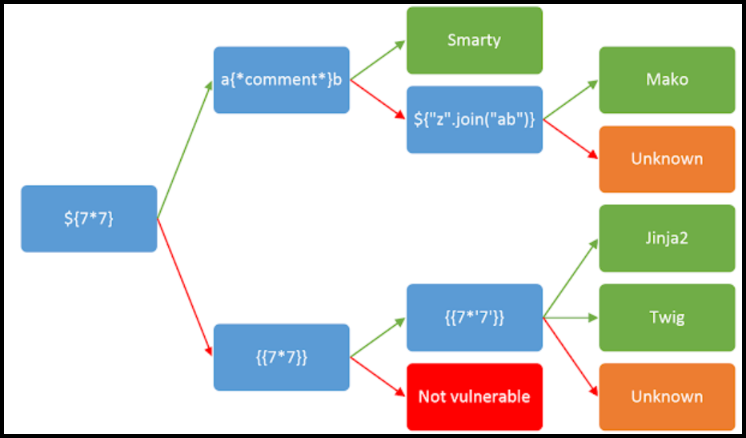

---
layout:
  title:
    visible: true
  description:
    visible: false
  tableOfContents:
    visible: true
  outline:
    visible: true
  pagination:
    visible: true
---

# SSTI 101


**Server-Side Template Injection (SSTI)** is a vulnerability where an attacker injects malicious template code into server-side templates, which is then executed by the server.



This can lead to remote code execution, data exposure, and unauthorized access, as attackers can manipulate the server-side template engine to run arbitrary code.



Validate and sanitize all user inputs, avoid using untrusted data in templates, and restrict the template engine's features to limit the potential impact of injections.


## Templating Engines

> _The content below is based on OffSec's_ [_WEB-200_](https://www.offsec.com/courses/web-200/) _course._

**Templating Engines** are used to display dynamically generated content on web applications. They replace the variables inside a template file with actual values and display these values to the client. For instance, if we wanted to draft an email for every customer such as:&#x20;


```
Hello x7331,

Thank you for ordering ExampleProduct with ID:123456! 

Your items will be shipped out shortly to 10 Example St, London, United Kingdom, EL3123.
```


We could create a template like:


```
Hello {{ name }},

Thank you for ordering {{product.name}} with ID:{{product.id}}! 

Your items will be shipped out shortly to {{address}}.
```


And then fill out the variables:

```json
{
  "name":"x7331",
  "address": "10 Example St, London, United Kingdom, EL3123",
  "cart":[
    {
      "name": "ExampleProduct",
      "id": "123456",
      "price":50"
    }
  ]
}
```

Template engines aimed at web applications can render the HTML template server-side or client-side. The former could result in RCE[^1], while the latter could only result in [XSS](../xss/). Some of the most popular templating engines can be found below:

| Templating Engine           | Language       | Server/client Side |
| --------------------------- | -------------- | ------------------ |
| [Twig](twig.md)             | PHP            | Server Side        |
| [Freemarker](freemarker.md) | Java (usually) | Server Side        |
| [Pug](pug.md) (_aka Jade_)  | JavaScript     | Mostly Server Side |
| [Jinja](jinja.md)           | Python         | Server Side        |
| [Handlebars](handlebars.md) | JavaScript     | Both               |
| [Mustache](mustache.md)     | Multiple       | Varies             |
| [Mako](mako.md)             | Python         |                    |

## SSTI

> _The content below is based on Hackmanit's article_ [_Template Injection Vulnerabilities – Understand, Detect, Identify_](https://hackmanit.de/en/blog-en/178-template-injection-vulnerabilities-understand-detect-identify)_._

### Manual Discovery

We can use polyglots to induce errors. The **error polyglot** produces an error message to 44 template engines. However, errors might be caught by the application. The **non-error polyglots** are constructed in such a way that at least one of them does not throw an error, but renders the polyglot modified for all popular template engines.

```bash
# The error polyglot
<%'${{/#{@}}%>{{
# Non-error polyglots
">[[${{1}}]]
<%=1%>@*#{1}
{##}/*{{.}}*/
```

```
{7*7}
${7*7}
#{7*7}
%{7*7}
{{7*7}}
```

<figure><figcaption><p>Figure 1: Identifying template engines (<em>image taken from</em> <a href="https://portswigger.net/web-security/server-side-template-injection"><em>here</em></a>).</p></figcaption></figure>

### Automatic Discovery

Tools like [TInjA](https://github.com/Hackmanit/TInjA), [SSTImap](https://github.com/vladko312/sstimap), and [j2ee-scan](https://github.com/PortSwigger/j2ee-scan) (Burp Pro) can automatically test for SSTI flaws by injecting combinations of special characters in template expressions (`${{<%[%'"}}%\`). Vulnerability indicators include:

* Thrown errors, revealing the vulnerability and potentially the template engine.
* Absence of the payload in the reflection, or parts of it missing, implying the server processes it differently than regular data.
* **Plaintext Context**: Distinguish from XSS by checking if the server evaluates template expressions.
* **Code Context**: Confirm vulnerability by altering input parameters. For instance, changing `greeting` in `http://vulnerable-website.com/?greeting=data.username` to see if the server's output is dynamic or fixed, like in `greeting=data.username}}hello` returning the username.

## Resources

* Some great information about the theory behind SSTI attacks ([article](https://hackmanit.de/en/blog-en/178-template-injection-vulnerabilities-understand-detect-identify))
* Engine-specific payloads ([HackTricks](https://book.hacktricks.wiki/en/pentesting-web/ssti-server-side-template-injection/index.html#exploits), [Template Injection Table](https://cheatsheet.hackmanit.de/template-injection-table/))

[^1]: Remote Code Execution
