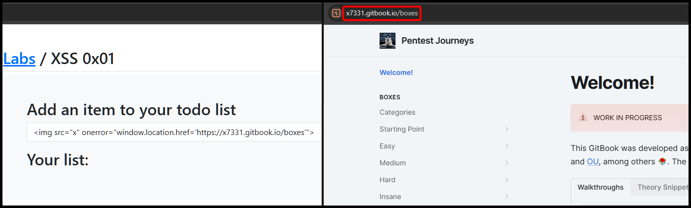
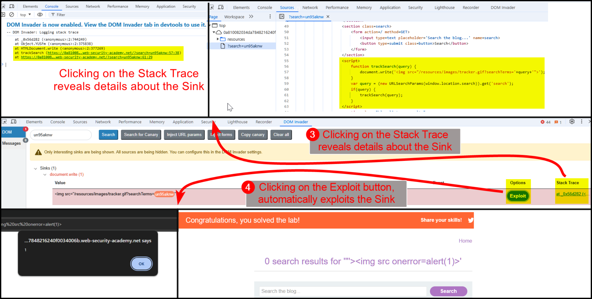
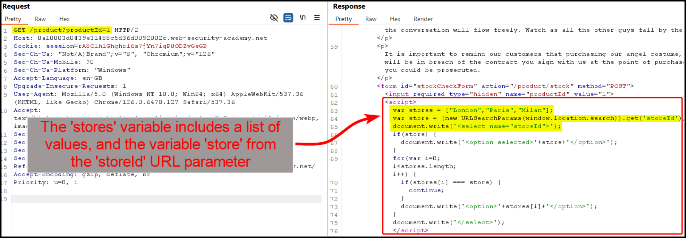
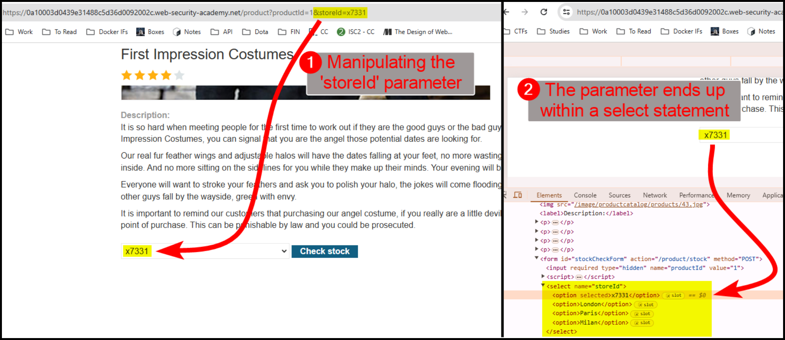

# DOM-Based


**DOM-Based XSS** occrus when the vulnerability is caused by unsafe manipulation of the DOM in the browser; it executes entirely on the client-side with no interaction from the server after the initial page load.



Attackers can inject malicious scripts that execute within the user's browser, potentially leading to data theft, unauthorized actions, or site defacement.


## Basic

> _The example below is based on TCM's_ [_Practical Bug Bounty_](https://academy.tcm-sec.com/p/practical-bug-bounty) _course._

When an item is added to the below to-do application, no network traffic is generated (Figure 1).

<figure><figcaption><p>Figure 1: Inspecting the network traffic of the application.</p></figcaption></figure>

If we try a common JavaScript payload, we get a prompt box back (Figure 2).

```javascript
// the JavaScript payload used

```

<figure><figcaption><p>Figure 2: Executing a DOM-based XSS attack.</p></figcaption></figure>

We can also use the above attack to redirect the user to another location (Figure 3).

```javascript
// the XSS payload used

```

<figure><figcaption><p>Figure 3: Executing a DOM-based XSS attack with redirection.</p></figcaption></figure>

## DOM Invader

> _The example below is based on PortSwigger's_ [_DOM XSS in `document.write` sink using source `location.search`_](https://portswigger.net/web-security/cross-site-scripting/dom-based/lab-document-write-sink) _lab._

We can automatically enumerate Sinks using the [DOM Invader](https://portswigger.net/burp/documentation/desktop/tools/dom-invader) extension within Burp's Chromium browser (Figure 4).


A **Sink** is a point in the web application where data is inserted into the DOM[^1] or executed as code. Sinks are the locations in the code where the untrusted input data can potentially cause malicious scripts to run if not properly sanitized. Examples of common sinks include:`innerHTML`, `outerHTML`, `document.write`, etc.


<figure><figcaption><p>Figure 4: Using DOM Invdader to enumerate sinks.</p></figcaption></figure>

DOM Invader was able to identify a Sink associated with `document.write`. We can find more about it when we click the `Stack Trace` link (Figure 5.3) as well as exploit it by clicking on the `Exploit` button (Figure 5.4).

<figure><figcaption><p>Figure 5: Using DOM Invader's features to find more about the Sink as well as exploit it.</p></figcaption></figure>

## Code Review

> _The example below is based on PortSwigger's_ [_DOM XSS in `document.write` sink using source `location.search` inside a select element_](https://portswigger.net/web-security/cross-site-scripting/dom-based/lab-document-write-sink-inside-select-element) _lab._

The response of the application's `/product` directory contains an interesting piece of code (Figure 6).

<figure><figcaption><p>Figure 6: Inspecting the application's front-end code.</p></figcaption></figure>

If we manipulate the `storeId` parameter, we notice that it ends up within a `select` statement (Figure 7).

<figure><figcaption><p>Figure 7: Manipulating the <code>storeId</code> parameter.</p></figcaption></figure>

We can terminate the `select` statement and then pass our payload to achieve XSS (Figure 8).

```javascript
// the JavaScipt payload used
</select>
```

<figure><figcaption><p>Figure 8: Achieving DOM-based XSS.</p></figcaption></figure>

[^1]: Document Object Model
